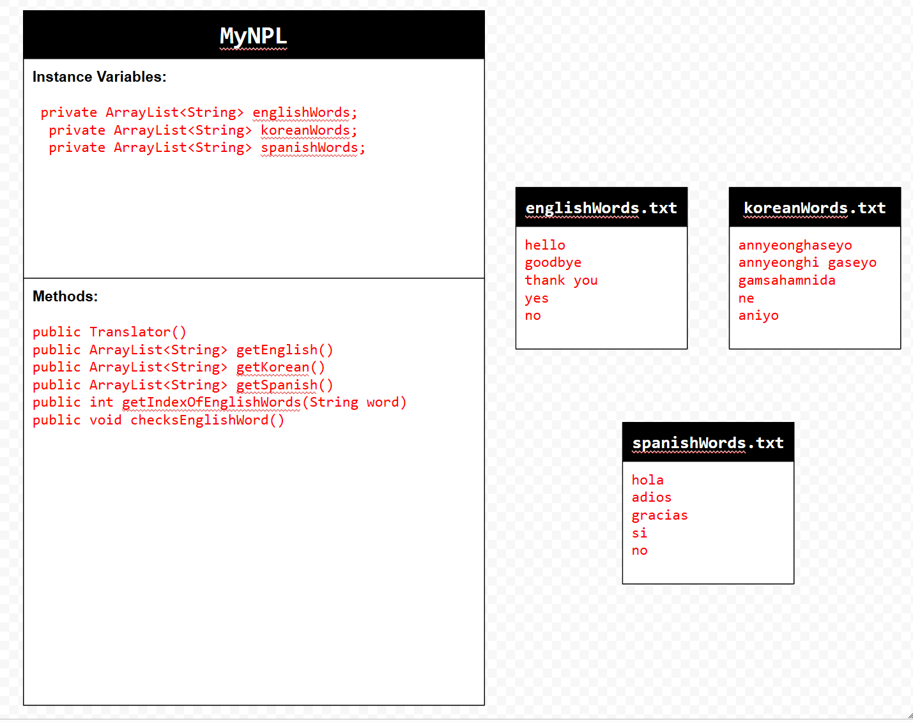
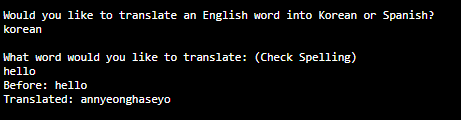

# Unit 6 - Natural Language Processing Project

## Introduction

Natural language processing (NLP) is used in many apps and devices to interact with users and make meaning of text to determine how to respond, find information, or to create new text. Your goal is to use natural language processing techniques to identify structure, patterns, and meaning in a text to have conversations with a user, execute commands, perform manipulations on the text, or generate new text.

## Requirements

Use your knowledge of object-oriented programming, ArrayLists, the String class, and algorithms to create a program that uses natural language processing techniques:

- **Create at least two ArrayLists** – Create at least two ArrayLists to store the data used in your program, such as data from text files or entered by the user.
- **Implement one or more algorithms** – Implement one or more algorithms that use loops and conditionals to find or manipulate elements in an ArrayList or String object.
- **Use methods in the String classs** - Use one or more methods in the String class in your program, such as to divide text into sentences or phrases.
- **Use at least one natural language processing technique** – Use a natural language processing technique to process, analyze, and/or generate text.
- **Document your code** – Use comments to explain the purpose of the methods and code segments and note any preconditions and postconditions.

## UML Diagram

## Video

Record a short video of your project to display here on your README. You can do this by:

- Screen record your project running on Code.org.
- Upload that recording to YouTube.
- Take a thumbnail for your image.
- Upload the thumbnail image to your repo.
- Use the following markdown code:

[] [(https://youtu.be/1CSNg2CaNt8) ](https://youtu.be/1CSNg2CaNt8)

## Project Description

The goal of my program is to translate certain or common english words into different languages. The current languages in the program that it can translate to is Spanish and Korean. It analyzes the text files of words and it works because the words in the different text files are on the same lines so they would have the same index. The user puts a word into the console because of the scanner method made and it takes that word translates it the selected language that they chose.

## NLP Techniques

A NLP technique that I believe I implemented in my project was key word extraction. One method that was associated with this was the getIndexOfEnglishWord() method because it uses a parameter to take the word that was given by the user and traverses the list of englishWords to see if that word is there and then returns the index to be used in the checksEnglishWords() method which gets the index and uses it to get the same index of either the Korean words or the Spanish words and the prints out the values. This is necessary because it checks if the word is in the list or not and if it isnt it would return a value like -1 to be used later for output. 